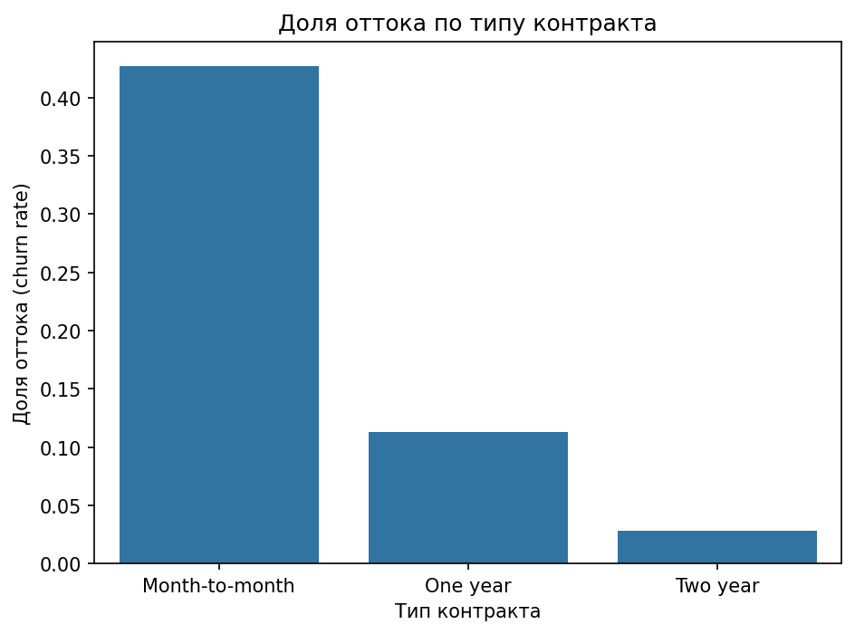
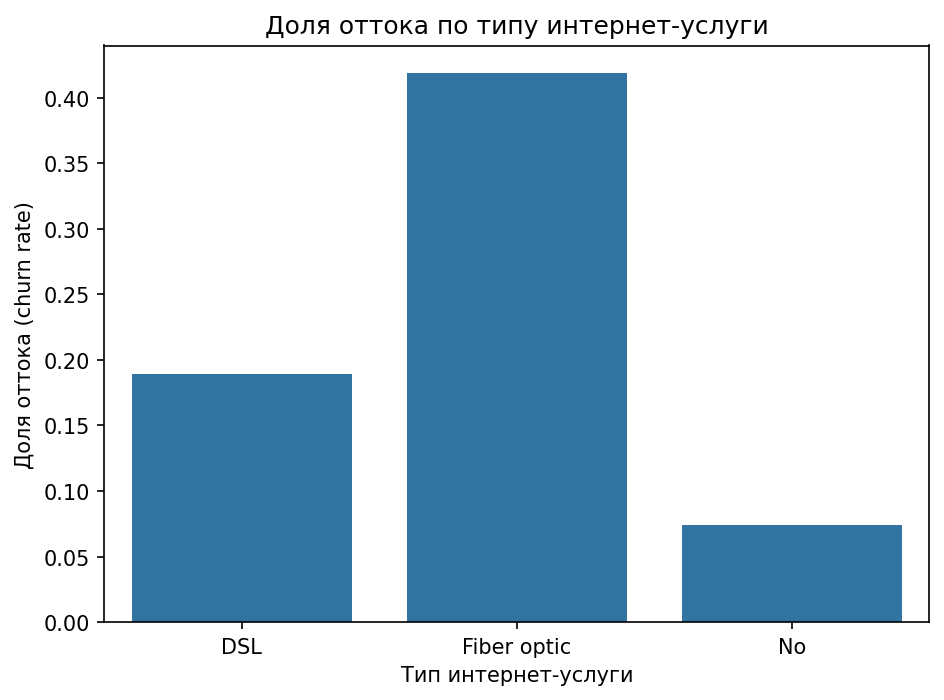
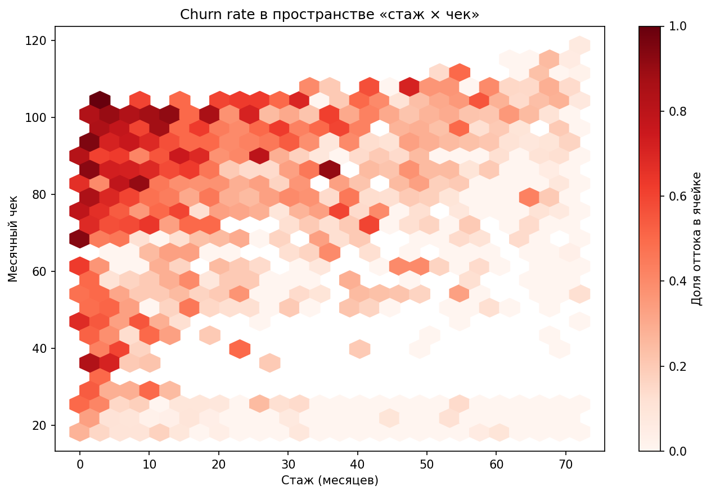
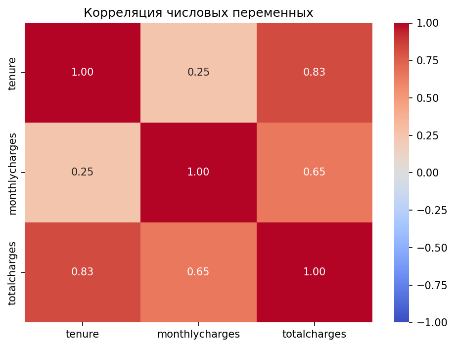

# Telecom Customer Intelligence Platform

Сквозной аналитический проект по оттоку клиентов телеком-провайдера: от загрузки данных и SQL-анализа до предсказательной модели и симуляции A/B-теста кампании удержания с оценкой окупаемости.

## Бизнес-вопрос

Кто из клиентов уйдёт, почему, сколько денег теряет компания и какая стратегия удержания окупится?

Для подписочного телеком-бизнеса удержание критично: привлечь нового клиента дороже, чем сохранить существующего, а уход клиента означает потерю всей его будущей ежемесячной выручки.

## Стек

PostgreSQL · Python (pandas, numpy, scikit-learn, statsmodels, matplotlib, seaborn) · Git

## Данные

[Telco Customer Churn](https://www.kaggle.com/datasets/blastchar/telco-customer-churn) — вымышленная телеком-компания, 7043 клиента, 21 признак: демография, подключённые услуги, тип контракта, способ оплаты, ежемесячный и суммарный платёж, флаг оттока.

Сам датасет в репозиторий не включён (скачивается в `data/raw/`).

## Структура репозитория

```
telecom-churn-intelligence/
├── etl/load_to_postgres.py      # ETL: CSV → очистка → PostgreSQL
├── sql/
│   ├── 01_schema.sql            # схема таблицы
│   └── analysis/                # 6 аналитических SQL-запросов
├── src/
│   ├── eda.py                   # разведочный анализ и визуализация
│   ├── model.py                 # ML: модель оттока
│   └── ab_test.py               # симуляция A/B-теста кампании удержания
├── reports/figures/             # сохранённые графики
├── models/                      # сериализованная модель и scaler
└── data/                        # raw (не в репо) и processed
```

## Этапы проекта

**ETL.** Данные очищаются в Python (приведение `TotalCharges` к числу с обработкой пустых значений у новых клиентов, кодирование таргета) и загружаются в PostgreSQL через пайплайн на SQLAlchemy. Креды вынесены в `.env` вне репозитория.

**SQL-анализ.** Шесть запросов с использованием CTE, оконных функций и условной агрегации формируют профиль оттока по контрактам, сроку жизни, выручке и типу услуг.

**EDA.** Визуализация подтверждает SQL-выводы и вскрывает взаимодействие между сроком жизни и размером чека, а также мультиколлинеарность числовых признаков.

**ML.** Логистическая регрессия (интерпретируемый baseline) предсказывает риск оттока; её коэффициенты независимо подтверждают факторы, найденные в SQL и EDA.

**A/B-симуляция.** На группе высокого риска (отобранной моделью) симулируется кампания удержания: расчёт мощности, z-тест на пропорциях, bootstrap доверительного интервала и перевод результата в деньги.

## Ключевые находки

Диагноз, подтверждённый тремя независимыми методами (SQL-агрегаты, визуализация, коэффициенты модели):

**Компания теряет дорогих клиентов на оптоволокне, на гибких месячных тарифах, в первый год жизни.**

Отток резко зависит от типа контракта — месячные тарифы уходят кратно чаще долгосрочных:



Оптоволокно (Fiber optic) — одновременно самый дорогой и самый текучий тип услуги:



Карта риска в пространстве «срок жизни × месячный чек» показывает, что риск максимален в сочетании малого стажа и высокого чека (левый верх), тогда как долгий стаж стабилизирует даже дорогих клиентов:



## Модель

Логистическая регрессия с балансировкой классов на тестовой выборке:

- **ROC-AUC: 0.846** — устойчивое ранжирование риска;
- **Recall (ушедшие): 0.80** — модель ловит 4 из 5 уходящих клиентов;
- приоритет recall над precision выбран осознанно: в задаче удержания пропустить уходящего клиента дороже, чем сделать ложную тревогу.

Среди числовых признаков `TotalCharges` исключён из-за мультиколлинеарности — он является произведением срока жизни и месячного чека:



## Симуляция кампании удержания

На группе высокого риска (топ-30% по предсказанной вероятности, реальный отток в ней — 59% против 27% в базе) симулируется кампания удержания и проверяется статистически:

- расчёт мощности определяет необходимый размер выборки под заданный эффект;
- z-тест на пропорциях проверяет значимость снижения оттока;
- bootstrap строит доверительный интервал на величину эффекта;
- результат переводится в спасённую выручку и окупаемость.

## Ограничения

Размер тестовой выборки ограничивает мощность эксперимента. Расчёт мощности показывает, что для надёжного обнаружения реалистичного эффекта retention-кампании (порядка 4 процентных пунктов) требуется существенно больше наблюдений, чем доступно в группе риска. Поэтому полученная оценка окупаемости положительна, но имеет широкий доверительный интервал — перед масштабированием кампании требуется полноценный эксперимент на большей выборке.

Датасет статический, без временных меток событий, поэтому когортный анализ удержания во времени не строился — анализ срока жизни проведён по полю `tenure` как срезу текущей базы.

## Запуск

```bash
python -m venv venv
venv\Scripts\activate          # Windows
pip install -r requirements.txt

# заполнить .env кредами PostgreSQL, затем:
psql -d telecom_churn -f sql/01_schema.sql
python etl/load_to_postgres.py
```

Анализ, модель и A/B-симуляция запускаются из соответствующих файлов в `src/`.
